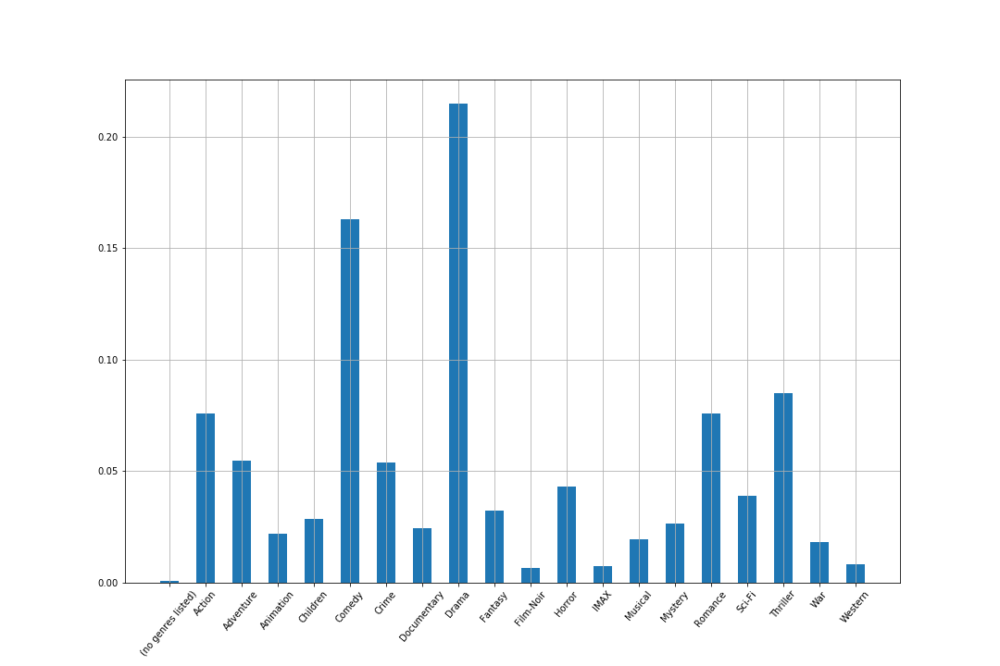

--- Based on Encoder and K-Means

====================================

Zhaoxi Chen | N18963553 | zc1134

Shangwen Yan | N17091204 | sy2160

## Abstract
recommender systems have become increasingly popular in recent years, and are utilized in a variety of areas including movies, music, news, books, research articles, search queries, social tags, and products in general. 
Here we implement a movie recommendation system based on Auto-Encoder and K-Meanse. The dataset is the popular one : movie-lens.

## Introduction
With the increasing development of technology and Internet, more and more customers choose to spend their spare time online instead of off-line. As a result, it's becoming of great importance to make a good use of the data produced by the consumers to offer a better consumption environment which is of great benefit both for merchants and customers.
As one of the results, recommender systems have become increasingly popular in recent years, and are utilized in a variety of areas including movies, music, news, books, research articles, search queries, social tags, and products in general. Here we implement a movie recommendation system using movie-lens dataset.

## Related works
### movie recommendation
Traditional way is to take the user, predict the ratings for all the movies from movies' catalog, sort the movies in descending order by the predicted ratings, then take the top 10 movies and recommend them. Some CNN methods also used in movie recommendation system. But all of this algorithm only focus on genres of movies but not user's characteristics.

### Encoder+K-means
This combination actually used more often in image classification. It's main idea is first move redundancy in images by an encoder. And then clustering images with encoded image can speed up the whole algorithm.

## Dataset
### Original dataset
Here we use the open dataset MovieLens. The relevant information is movies’ratings,genres,tags given by users
Number of users:7120，Number of movies: 27278，Number of ratings: 1048575
__Files we use:__
|movie.csv|||
|-|-|-|
|movieId|title| genres|

|rating.csv||||
|-|-|-|-|
|userId|movieId| rating|timestamp|

### Training data
Since it's a clustering problem, it's more important to train the clusters. We only use 7100 users for traing, and make the data in to a torch of size (7100,27278,3) which means (number of users, number of movies, (rating, mean_rating, genres)). Since genres are given as text, we use one-hot-coding to turn it into binary int, and then decimal int.

### Testing data
We only use 20 users for testing case. And for those testing users, we split the most recently 20 ratings used to compared with the recommended movies, and the past records to go through the encoder and k-means to do the recommendation

## Architecture
The whole architecture is: first we use encoder to reduce the number of features which makes it simpler for the kmeans part, then use k-means to group the users into 9 clusters. After calculating the scores movies in each clusters, we recommend 30 movies which have not been seen by the users to them.

### Encoder part

First, we  train an autoencoder to make the decoded and input matrix as samilar as possible.

To make sure AE’s weights  are  orthogonal , we add penalty to __MSE loss:__

$L(W) = MSE +\lambda (W^TW-I)$

__epoch vs loss:__

|__epoch vs loss__|__input vs decoded__|
|-|-|
|| |

The encoded tensor represents input tensor well, but with fewer features, which makes it easier for clustering  in k-means part.

###k-means part:
Then use encoded  tensor to do a k-means clustering which generates 9 clusters of user-groups.
For each cluster(user_group), we sum up users’ ratings for each movie and sort the movies by rating desc. 
Then use the top 50 movies’ genres to generate a word cloud to see which kind of movie is popular in that user group.

|word cloud||||
|-|-|-|-|
|__bar plot__||| |
|__after scaling__||||

|word cloud||||
|-|-|-|-|
|__bar plot__||||
|__after scaling__||||

|word cloud||||
|-|-|-|-|
|__bar plot__||| |
|__after scaling__||||

Since ‘Drama’ and ‘Comedy show up frequently, we do a genre analysis among all movies(no clusters).

From the plot we could find some genres, like Drama and Comedpngy,  are ‘common types’ which are specified to most movies. And thus, most clusters contains this two genres is reasonable.
So we scale the frequency of genres based on their probabilities among all movies. As we can see, the difference after scaling is kind of obvious.

## Recommen Movies
For every users go through the encoder and kmeans to put him into a cluster. Then recommend those movies with highest scores rated by users in the same cluster to him.

## Test Case
Recommend 30 movies to a user based on his past watching history.  Compare the results with those movies he  most recently watched.
here shoes one user's result:

__Recommend:__
Beauty and the Beast
Speed

__Actually watched:__
Beauty and the Beast
Speed 2

